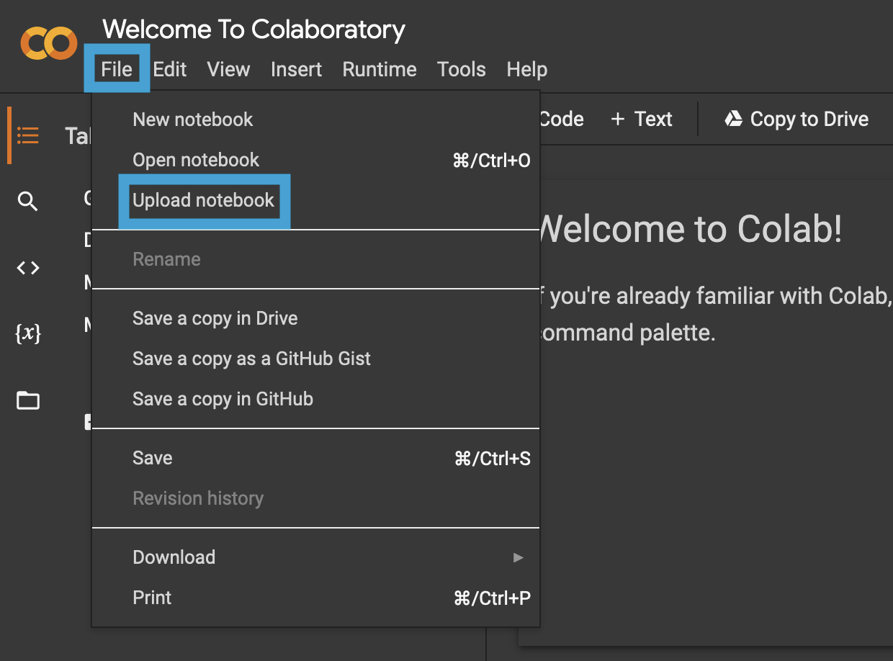
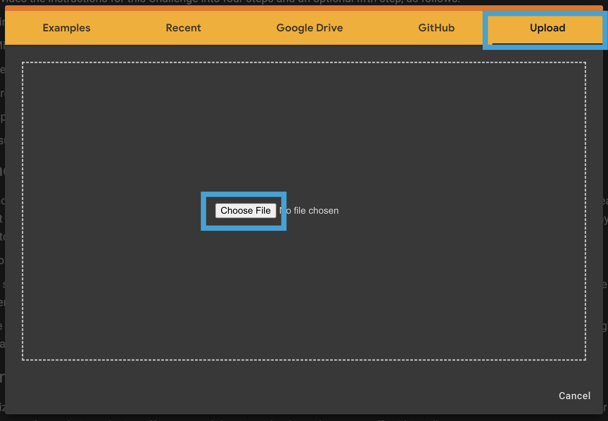

# Analysis of Search Traffic, Stock Price, and Sales

This is analysis looks a trends and forecasts searches, stock price, and revenue for an ecommerce company.


## Technologies

This project leverages python 3.7 with the following packages:

- [colab](https://colab.research.google.com/) - For running a `jupyter server` remotely
- [numpy](https://numpy.org/) - For numerical operations
- [pandas](https://pandas.pydata.org/) - For analyzing and transforming data   
- [holoviews](http://holoviews.org/) - For creating interactive plots
- [prophit](https://facebook.github.io/prophet/) - For time series analysis and forecasting


## Installation Guide

Before running the application first install the following dependencies.  

__Important:__ `pystan` must be installed prior to installing `prophet`.

```python
  pip install holoviews
  pip install hvplot
  pip install numpy
  pip install pandas
  pip install pystan==2.19.1.1
  pip install prophet
```


## Usage

Because `prophet` can be challenging to install, this analysis can be viewed one of two ways:

1) Locally - If you already have `prophet` installed locally, or are able to successfully install it, running `jupyter lab` or `jupyter notebook` in the directory where `forecasting_net_prophet.ipynb` is stored will allow you to view and interact with the content of the analysis.

When running the notebook locally, ignore the first code cell with the comment `# Install the required libraries`

2) [Google Colab](https://colab.research.google.com/) - If you're unable to install `prophet` locally, or do not wish to, the notebook is designed to be run with Google Colab. On the home page, clicking _File_ in the top left menu bar will generate a dialogue box with the option to upload a notebook.  

  
Clicking _Upload notebook_ will generate another dialogue box. Be sure to click _Upload_ in the top right corner and click _Choose File_ to upload `forecasting_net_prophet_.ipynb`.

  
Once the notebook has been uploaded to Google Colab it can be run similar to running it locally on a Jupyter server.


## Contributors
Josh Mischung: [josh@knoasis.io](josh@knoasis.io), [LinkedIn](https://www.linkedin.com/in/joshmischung/)


## License

MIT License

Copyright (c) [2022] [Joshua Mischung]

Permission is hereby granted, free of charge, to any person obtaining a copy
of this software and associated documentation files (the "Software"), to deal
in the Software without restriction, including without limitation the rights
to use, copy, modify, merge, publish, distribute, sublicense, and/or sell
copies of the Software, and to permit persons to whom the Software is
furnished to do so, subject to the following conditions:

The above copyright notice and this permission notice shall be included in all
copies or substantial portions of the Software.

THE SOFTWARE IS PROVIDED "AS IS", WITHOUT WARRANTY OF ANY KIND, EXPRESS OR
IMPLIED, INCLUDING BUT NOT LIMITED TO THE WARRANTIES OF MERCHANTABILITY,
FITNESS FOR A PARTICULAR PURPOSE AND NONINFRINGEMENT. IN NO EVENT SHALL THE
AUTHORS OR COPYRIGHT HOLDERS BE LIABLE FOR ANY CLAIM, DAMAGES OR OTHER
LIABILITY, WHETHER IN AN ACTION OF CONTRACT, TORT OR OTHERWISE, ARISING FROM,
OUT OF OR IN CONNECTION WITH THE SOFTWARE OR THE USE OR OTHER DEALINGS IN THE
SOFTWARE.
